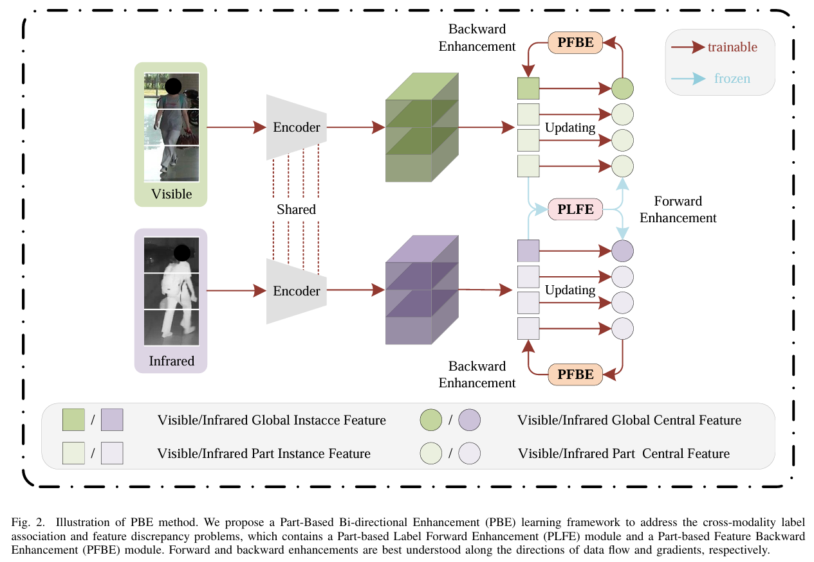

# 🚀 Part-Based Bi-Directional Enhancement Learning for Unsupervised Visible-Infrared Re-Identification

The *official* repository for [Part-Based Bi-Directional Enhancement Learning for Unsupervised Visible-Infrared Re-Identification](https://ieeexplore.ieee.org/abstract/document/11230802). We achieve state-of-the-art performances on **unsupervised visible-infrared person re-identification** task.

# **🧠 Our unified framework**


# ✨ Highlight

1. We propose a novel Part-based Bidirectional Enhancement (PBE) framework for the unsupervised learning visible-infrared person re-identification task including two main components: a Part-based Label Forward Enhancement (PLFE) module to alleviate the cross-modality label association problem and a Part-based Feature Backward Enhancement (PFBE) module to mitigate the cross-modality feature discrepancy problem.
2. We design a Part-based Label Forward Enhancement (PLFE) module to generate high-quality VI-associated pseudo-labels by employing part features to complement global features during the label association process.
3. We present a Part-based Feature Backward Enhancement (PFBE) module to learn more robust uniform features by utilizing part features to augment global features for contrastive loss during the feature learning process. 
4. Extensive experimental results show the advanced performance of the PBE method, demonstrating the effectiveness of our proposed approach.

# 📂 Prepare Datasets
Put SYSU-MM01 and RegDB dataset into `data/sysu` and `data/regdb`, run `prepare_sysu.py` and `prepare_regdb.py` to prepare the training data (convert to market1501 format).

# 🔥 Training

We utilize 4 NVIDIA 3090 GPUs for training.

**examples:**

SYSU-MM01:

1. Train:
```shell
sh sba_train_sysu.sh
```


2. Test:
```shell
sh sba_test_sysu.sh
```

RegDB:

1. Train:
:
```shell
sh sba_train_regdb.sh
```

2. Test:
```shell
sh sba_test_regdb.sh
```


# Citation
This code is based on previous works, including [GUR](https://github.com/yangbincv/GUR) and [ADCA](https://github.com/yangbincv/ADCA). 🙏 
If you find this code useful for your research, please cite our papers.

```
@ARTICLE{He_2025_TIFS,
  author={He, Qiaolin and Yang, Yiming and Wang, Zihan and Hu, Haifeng},
  journal={IEEE Transactions on Information Forensics and Security}, 
  title={Part-Based Bi-Directional Enhancement Learning for Unsupervised Visible-Infrared Re-Identification}, 
  year={2025},
  volume={20},
  number={},
  pages={12051-12065},
  keywords={Representation learning;Feature extraction;Training;Bidirectional control;Unsupervised learning;Manuals;Identification of persons;Noise;Annotations;Reliability;Visible-infrared person re-identification;unsupervised learning;part feature},
  doi={10.1109/TIFS.2025.3629565}}
```


